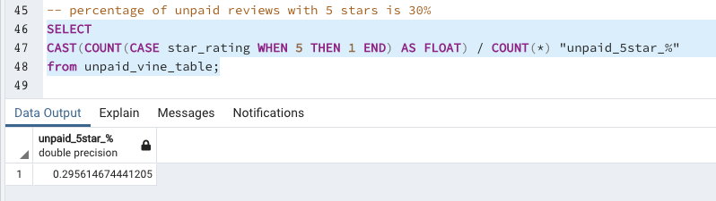

# Amazon Vine Analysis

Created an ETL pipeline using pyspark to extract a data source of amazon reviews, transform the data into multiple data frames, then load the data into a postgres SQL database running in AWS.

## Analysis Overview

My client SellBy is paying a small fee to Amazon who in turns provides products to there Amazon Vine members required to publish reviews. SellBy would like to make sure they are getting something for their money and have tasked me to see if there is a bias towards positive reviews from Vine members.

## Results
- There were 231 reviews from Vine members vs 16,464 from non-Vine members

- There were 93 5-star reviews from Vine members vs 4,867 from non-Vine members

- Thus the percentage of 5-star reviews from Vine members was 40% vs 30% from non-Vine members

## Summary
The data does show the percentage of 5-star reviews from Vine members is 10% higher than non-Vine members, suggesting some positive bias. In addition to this analysis, I would suggest finding the average star rating of Vine members vs non-Vine members and run a two sample t-test to deteremine if the difference is statistically significant. 

